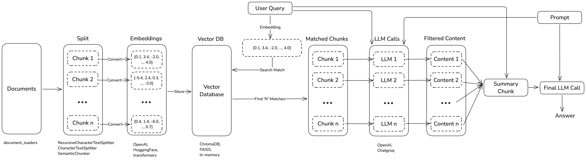

# CandiGenie

CandiGenie is an intelligent candidate recommendation system designed to streamline the process of matching project requirements with suitable candidates based on their resumes. It leverages state-of-the-art machine learning models and a vector database for efficient document retrieval and analysis.

## Problem Statement

Organizations often face challenges in quickly and accurately identifying candidates who fit specific project requirements. Manual screening of resumes is time-consuming and prone to errors. CandiGenie automates this process by:

- Extracting and analyzing resume data.
- Generating embeddings for efficient document comparison.
- Providing detailed and accurate candidate recommendations.

## Features

- **Resume Processing**: Automatically loads and processes resumes from a specified folder.
- **Query Analysis**: Matches project requirements with resumes using semantic search.
- **LLM Integration**: Leverages a Large Language Model (LLM) to analyze and interpret resume data in the context of project requirements.
- **Interactive UI**: Easy-to-use Streamlit interface for inputting project requirements and viewing results.
- **Performance Metrics**: Provides detailed timing information for each step of the process.

## Technologies Used

- **Programming Languages**: Python
- **Frontend Framework**: Streamlit
- **Backend Technologies**:
  - LangChain
  - Hugging Face Embeddings
  - ChromaDB
- **Machine Learning Models**:
  - Sentence Transformers ("all-mpnet-base-v2")
  - LLM (e.g., LLaMA-3.1)
- **Other Tools**:
  - Pandas for data manipulation
  - dotenv for environment variable management

## Architecture Flow



1. **Resume Upload**: Users upload resumes to the `resource` folder in docx format.
2. **Resume Processing**:
   - Extract text from resumes (.docx files).
   - Split text into manageable chunks.
   - Generate embeddings for each chunk using Hugging Face models.
   - Store the processed data in ChromaDB.
3. **Query Input**: Users provide project requirements via a text area in the Streamlit UI.
4. **Vector Search**: Find relevant resumes using similarity search in ChromaDB.
5. **LLM Analysis**:
   - Generate responses for each relevant resume using LLaMA-3.1.
   - Consolidate responses into a final output.
6. **Output**:
   - Display candidate recommendations.
   - Show performance metrics.

## How to Operate

1. Place the resumes (.docx files) in the `resource` folder.
2. Run the application locally (see instructions below).
3. Enter project requirements in the text area provided in the Streamlit UI.
4. Click "Analyze" to get candidate recommendations.
5. Review the results and performance metrics displayed on the interface.

## Running the Project Locally

### Prerequisites

- Python 3.12.0 or later
- An API key for Groq (set as `GROQ_API_KEY` in the `.env` file)

### Installation

1. Clone the repository:

   ```bash
   git clone <repository-url>
   cd <repository-folder>
   ```

2. Install the dependencies:

   ```bash
   pip install -r requirements.txt
   ```

3. Set up the `.env` file with your Groq API key:

   ```plaintext
   GROQ_API_KEY=<your_api_key>
   ```

### Running the Application

1. Start the application:

   ```bash
   streamlit run resume_analysis_tool.py
   ```

2. Open the provided URL in your web browser (default: <http://localhost:8501>).
3. Follow the instructions on the UI.

## Future Enhancements

- Support for additional file formats (e.g., PDFs, plain text).
- Integration with third-party ATS (Applicant Tracking Systems).
- Improved ranking and filtering mechanisms.
- Multi-language support for resumes and queries.
- Enhanced UI with visualization features.

## Contributing

Contributions are welcome! Please follow these steps:

1. Fork the repository.
2. Create a new branch for your feature/bug fix.
3. Commit your changes with clear messages.
4. Open a pull request to the main branch.
